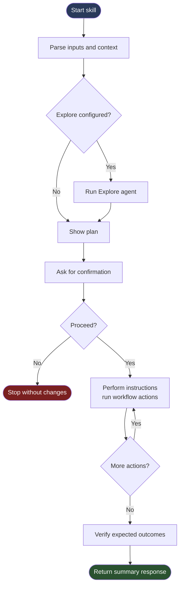

# Canopy — Framework Specification

See [README.md](README.md) for overview, quick start, and setup.

---

## Framework Agents

`canopy` is a framework **agent** — it creates, modifies, scaffolds, validates, and converts Canopy skills.

When modifying `FRAMEWORK.md`, `rules/skill-resources.md`, `skills/shared/framework/ops.md`, or `skills/shared/project/ops.md`,
also update the relevant policy files in `agents/canopy/policies/` to stay in sync.

### Agent Format

Agents live at `.claude/agents/<name>.md` and use Claude Code's native agent frontmatter:

```markdown
---
name: agent-name
description: When to invoke this agent (used for routing in the subagent picker)
tools: Read, Write, Edit, Glob, Grep, Bash
---

System prompt content...
```

Agent resource files follow the same category subdirectory conventions as skills:

| Directory | Content |
|-----------|---------|
| `agents/<name>/policies/` | Policy files read by the agent at runtime |
| `agents/<name>/schemas/` | JSON schemas used as output contracts or examples |
| `agents/<name>/templates/` | Skeleton files substituted and written by the agent |

The setup scripts create symlinks (Linux/macOS) or junctions (Windows) in `.claude/agents/`
for each bundled agent and its resource directories, mirroring the skill symlink pattern.

---

## Directory Layout

### Standalone (Canopy is `.claude/`)

```
.claude/                              ← clone or copy of claude-canopy
├── agents/
│   ├── canopy.md                   # Framework-bundled agent
│   └── canopy/                     # Agent resource files
│       ├── constants/              # Lookup tables and dispatch maps
│       ├── ops/                    # Per-operation procedure files
│       ├── policies/               # Rule files (skill-structure, writing, op-naming, …)
│       ├── schemas/
│       │   └── explore-schema.json
│       ├── templates/
│       │   ├── skill.md
│       │   └── ops.md
│       └── verify/                 # Expected-state checklists per operation
├── rules/
│   └── skill-resources.md          # Ambient rules — auto-applied to all skill files
└── skills/
    ├── shared/
    │   ├── framework/
    │   │   └── ops.md              # Framework primitives (IF, ASK, SHOW_PLAN, …)
    │   ├── project/
    │   │   └── ops.md              # Project-wide ops — add your own here
    │   └── ops.md                  # Redirect stub — see framework/ and project/
    ├── FRAMEWORK.md                # This file
    └── <your-skill>/
        ├── skill.md                # Skill definition — frontmatter + Tree + Rules
        ├── ops.md                  # Skill-local op definitions
        ├── schemas/                # Subagent output contracts, input/config file shapes
        ├── templates/              # Fillable output documents with <token> placeholders
        ├── commands/               # PowerShell / shell scripts with named sections
        ├── constants/              # Read-only lookup data (tables, enum values, defaults)
        ├── checklists/             # Evaluation criteria lists iterated by ops
        ├── policies/               # Behavioural constraints governing skill execution
        └── verify/                 # Expected-state checklists for VERIFY_EXPECTED
```

### As Git Submodule (recommended for projects)

See [README.md](README.md) for submodule setup and wiring instructions.

---

## Notation

| Symbol | Meaning |
|--------|---------|
| `<<` | Input — source file, condition to evaluate, or user-facing options |
| `>>` | Output — fields captured into step context, or fields displayed to user |
| `\|` | Separator — between multiple inputs, options, or output fields |

Examples:
```
VAULT_KV_READ secret/app/creds >> {client_id, client_secret}
ASK << Proceed? | Yes | No
FETCH_GITHUB_RELEASES << org/repo >> breaking-changes
SHOW_PLAN >> files | Vault changes | API calls
```

---

## Skill Anatomy

See [README.md](README.md) for the full skill anatomy reference.

---

## Workflow Diagram

High-level execution flow of a Canopy skill:



Source file: [docs/diagrams/workflow.mmd](diagrams/workflow.mmd).

If your Mermaid tool reports "No diagram type detected", open [docs/diagrams/workflow.mmd](diagrams/workflow.mmd) directly or pass only the Mermaid code block content (without surrounding Markdown text).

---

## Tree Execution Model

The tree is a **sequential pipeline** with branching. Execution is:
1. Start at the root node
2. Execute each sibling top-to-bottom
3. For `IF`/`ELSE_IF`/`ELSE` chains: evaluate conditions in order; execute first matching branch; skip the rest
4. After a branch completes, resume on the next sibling after the chain
5. `EXPLORE` is always the first node if an `## Agent` section is present

**Node types:**

| Node | Form | Behaviour |
|------|------|-----------|
| Op call | `OP_NAME << inputs >> outputs` | Look up and execute op definition |
| Natural language | any prose | Execute as described |
| `IF` | `IF << condition` | Branch — execute children if true |
| `ELSE_IF` | `ELSE_IF << condition` | Continue chain — execute if prior false |
| `ELSE` | `ELSE` | Close chain — execute if all prior false |

**Tree syntax — two equivalent formats:**

*Markdown list syntax* — `*` nested lists written directly under `## Tree` (no fenced code block):

```markdown
* skill-name
  * OP_ONE << input
  * IF << condition
    * OP_TWO
  * ELSE
    * natural language step
  * OP_THREE >> output
```

*Box-drawing syntax* — fenced code block with tree characters:

```
skill-name
├── OP_ONE << input
├── IF << condition
│   └── OP_TWO
├── ELSE
│   └── natural language step
└── OP_THREE >> output
```

Both are parsed identically. Use whichever reads more naturally for the skill.

---

## Control Flow Primitives

Defined in `skills/shared/framework/ops.md`. Always looked up there — never overridden in skill-local or project ops.

### `IF << condition`
```
IF << condition
├── then-branch (op or natural language)
[ELSE_IF << condition2
 ├── branch2]
[ELSE
 └── else-branch]
```

### `ELSE_IF << condition`
Continues an `IF` or `ELSE_IF` chain. Only evaluated if all prior conditions were false.

### `ELSE`
Closes an `IF` or `ELSE_IF` chain. Executed only if all prior conditions were false.

### `ASK << question | option1 | option2 [| ...]`
Present a question with options. Execution halts until the user responds.

### `SHOW_PLAN >> field1 | field2 | ...`
Present a structured pre-execution plan covering the listed fields.

### `VERIFY_EXPECTED << verify/verify-expected.md`
Check current state against expected outcomes in the verify file.

---

## Op Lookup Order

When a tree node contains an `ALL_CAPS` identifier:

1. **`<skill>/ops.md`** — skill-local ops (checked first)
2. **`shared/project/ops.md`** — project-wide ops
3. **`shared/framework/ops.md`** — framework primitives (fallback)

Primitives (`IF`, `ELSE_IF`, `ELSE`, `ASK`, `SHOW_PLAN`, `VERIFY_EXPECTED`, `BREAK`, `END`) always
resolve to `shared/framework/ops.md` and are never overridden.

---

## Skill-Local `ops.md`

Skill-specific branches, multi-step procedures, and decision trees. Lives alongside
`skill.md`, not in a subdirectory.

**Simple op** — prose for linear behavior:
```markdown
## FETCH_CHART_DEFAULTS

Fetch the chart's upstream default values from the internet to confirm the current image and tag.
```

**Branching op** — use tree notation (either syntax):

Box-drawing format:
```markdown
## EDIT_IMAGE_TAG << image_defined_in | target_tag

\`\`\`
EDIT_IMAGE_TAG << image_defined_in | target_tag
├── IF << image_defined_in = chart-defaults-only
│   └── CREATE_ENV_OVERRIDE
└── ELSE — edit tag in-place at the path from image_defined_in
\`\`\`
```

Markdown list format:
```markdown
## EDIT_IMAGE_TAG << image_defined_in | target_tag

* EDIT_IMAGE_TAG << image_defined_in | target_tag
  * IF << image_defined_in = chart-defaults-only
    * CREATE_ENV_OVERRIDE
  * ELSE — edit tag in-place at the path from image_defined_in
```

Op definitions calling other ops (including shared ops) is valid — the system is self-similar.

---

## Op Registries

### Framework primitives (`skills/shared/framework/ops.md`)

Control-flow and interaction ops available in every skill, in every project.

| Op | Signature | Purpose |
|----|-----------|---------|
| `IF` | `<< condition` | Branch on condition |
| `ELSE_IF` | `<< condition` | Continue IF chain |
| `ELSE` | — | Close IF chain |
| `BREAK` | — | Exit current op, resume caller |
| `END` | `[message]` | Halt skill execution |
| `ASK` | `<question> << option1 \| ...` | Prompt user; halt until response |
| `SHOW_PLAN` | `>> field1 \| ...` | Present pre-execution plan |
| `VERIFY_EXPECTED` | `<< verify/verify-expected.md` | Check state against expected outcomes |

### Project-wide ops (`skills/shared/project/ops.md`)

Project-specific ops shared across skills in this project. Add here when a pattern appears in 2+ skills or has complex multi-step behavior worth naming. Op definitions follow the same tree notation as skills; lookup order places them after skill-local ops but before framework primitives.

---

## Category Resource Subdirectories

When a tree node or op step says `Read <category>/<file>`, the directory determines behavior:

| Directory | File types | Behavior |
|-----------|------------|----------|
| `schemas/` | `.json`, `.md` | Structure definitions for data the skill reads or writes: subagent output contracts, input/config file shapes, report template skeletons |
| `templates/` | `.yaml`, `.md`, `.yaml.gotmpl` | Fillable output documents with `<token>` placeholders substituted from context and written to a target path |
| `commands/` | `.ps1`, `.sh` | Executable scripts invoked by name via a named section (`# === Section Name ===`); output captured into context |
| `constants/` | `.md` | Read-only lookup data referenced by ops: mapping tables, enum-like value lists, fixed configuration values, default branch/path names |
| `checklists/` | `.md` | Evaluation criteria lists (`- [ ] ...`) that ops iterate over to assess compliance or correctness |
| `policies/` | `.md` | Behavioural constraints governing skill execution: what the skill must/must not do, consent requirements, output rendering protocols |
| `verify/` | `.md` | Expected-state checklists consumed exclusively by `VERIFY_EXPECTED` |

**Reference line pattern:** `Read \`<category>/<file>\` for <brief description>.`
Load at point of use in the tree — never front-load all reads at the top.

---

## Ambient Rules

`rules/skill-resources.md` carries `globs` in its frontmatter.
It is automatically active whenever any skill file is read — no per-skill loading needed.
It encodes the category behavior table, op lookup order, tree execution model, and explore
subagent contract.

When using Canopy as a submodule, create a project-level `rules/skill-resources.md` that
overrides the canopy default — update the globs and op lookup paths to match your layout.

---

## Debug Mode

The `debug` meta-skill wraps any other skill with live phase banners and per-node tree
tracing. Invoke as:

```
/canopy-debug <skill-name> [arguments]
```

Example:

```
/canopy-debug bump-version 2.1.0
```

Debug mode emits to the stream as the skill runs:

- A **phase banner** at the start of each execution phase (Initialize, Explore, Tree
  Execution, Verify, Response) — only phases active for the given skill are shown
- A **tree-state block** before and after each node, showing all nodes with status
  symbols: `→` executing, `✓` done, `⊘` skipped, `⏸` waiting, `⟳` subagent, `✗` failed,
  `⊙` pending
- **Input/output values** for nodes with formal `<<` / `>>` declarations

No changes to existing skills are required. The feature is entirely contained in
`skills/canopy-debug/` and activated only when the user calls `/canopy-debug`.

The setup scripts auto-discover `skills/canopy-debug/` and create the appropriate
symlink or junction — no manual wiring needed after running setup.

See `skills/canopy-debug/policies/canopy-debug-output.md` for the full visual protocol.
